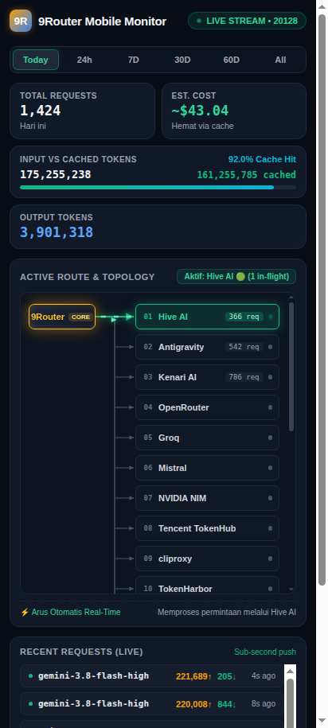

# 9Router Mobile Monitor

A lightweight, mobile-first telemetry dashboard and PWA for [9Router](https://github.com/decolua/9router). Designed for fast mobile monitoring over local networks or WireGuard VPN without desktop dashboard bloat.

<p align="center">
  
</p>

---

## Why I Built This

I run 9Router on my home server as a central gateway to route requests across multiple LLM providers, handle failovers, and track token usage. The built-in 9Router dashboard is great on desktop, but when I'm away from my desk and checking my phone over WireGuard, I wanted something:

1. **Lightweight & Fast:** Opens instantly without heavy client-side bundles or build steps.
2. **Mobile-Optimized:** Fits small vertical screens neatly with touch-friendly controls.
3. **Live Telemetry:** Shows which upstream provider is handling requests right now with animated circuit paths.
4. **Zero Extra Dependencies:** Pure vanilla HTML/CSS/JS frontend paired with a tiny Python proxy script using only standard library modules.

---

## Key Features

- **Dynamic Priority Topology:** 
  - The `9Router` core node sits at the top left, aligned horizontally with Slot #1.
  - Active upstream providers automatically jump to the top of the queue in real-time as requests come in.
  - Strictly orthogonal 90° circuit lines with running green beam animations indicate active in-flight traffic.
  - Inactive providers smoothly slide down and rest in standby.
- **Native Real-Time SSE Stream:** Connects directly to 9Router's `/api/usage/stream` for sub-second status updates.
- **KPI Metrics & Cache Hit Tracking:** Displays Total Requests, Estimated Cost, Input Tokens, Cached Tokens, Cache Hit %, and Output Tokens.
- **Time Horizon Filters:** Quickly switch between `Today`, `24h`, `7D`, `30D`, `60D`, and `All`.
- **Live Request Feed:** A compact stream of recent model calls, prompt/completion token counters, status indicators, and elapsed time.
- **Progressive Web App (PWA):** Includes `manifest.json` and a service worker. You can add it to your Android or iOS home screen for a full-screen, standalone app experience.

---

## Architecture

```text
  [ Android Phone / Browser ]
              │
              │  HTTP / PWA (Port 20130)
              ▼
    [ server.py Micro-Proxy ]
              │
              │  Internal API & SSE Forwarding
              ▼
       [ 9Router Core ]  (Port 20128)
```

`server.py` serves the static frontend and transparently proxies `/api/*` endpoints and `/api/usage/stream` (SSE) to your local 9Router instance, avoiding CORS issues when accessing from mobile devices across different LAN/VPN subnets.

---

## Getting Started

### Prerequisites

- Python 3.8+ (standard library only, no `pip install` required)
- A running 9Router instance (defaulting to `http://127.0.0.1:20128`)

### Running Locally

1. Clone the repository:
   ```bash
   git clone https://github.com/danskiv/9router-mobile-monitor.git
   cd 9router-mobile-monitor
   ```

2. Start the server:
   ```bash
   python3 server.py
   ```

3. Open in your browser:
   ```text
   http://localhost:20130
   ```
   *(Or replace `localhost` with your server's LAN or WireGuard IP when accessing from your phone, e.g. `http://10.10.10.1:20130`)*

---

## Production Setup

### Option 1: Running with PM2 (Recommended)

If you already use PM2 on your server:

```bash
pm2 start server.py --name "9router-mobile" --interpreter python3
pm2 save
```

### Option 2: Running as a Systemd Service

Create a service file at `/etc/systemd/system/9router-mobile.service`:

```ini
[Unit]
Description=9Router Mobile Monitor Service
After=network.target

[Service]
Type=simple
User=<your-username>
WorkingDirectory=/path/to/9router-mobile-monitor
ExecStart=/usr/bin/python3 /path/to/9router-mobile-monitor/server.py
Restart=always
RestartSec=3
Environment="PORT=20130"
Environment="NINE_ROUTER_URL=http://127.0.0.1:20128"

[Install]
WantedBy=multi-user.target
```

> **Note:** Replace `<your-username>` with your actual Linux user (e.g. `$(whoami)`) and `/path/to/9router-mobile-monitor` with the absolute path where you cloned this repository (e.g. `$PWD`).

Enable and start the service:

```bash
sudo systemctl daemon-reload
sudo systemctl enable --now 9router-mobile
```

---

## Configuration

You can customize the listening port and 9Router target URL via environment variables:

| Variable | Default | Description |
| :--- | :--- | :--- |
| `PORT` | `20130` | Port for the mobile monitor web interface |
| `HOST` | `0.0.0.0` | Bind address |
| `NINE_ROUTER_URL` | `http://127.0.0.1:20128` | URL of your upstream 9Router service |

Example:
```bash
PORT=8080 NINE_ROUTER_URL=http://127.0.0.1:20128 python3 server.py
```

---

## Installing on Android (PWA)

1. Connect your phone to your local Wi-Fi or WireGuard VPN.
2. Open Chrome and navigate to `http://<your-server-ip>:20130`.
3. Tap the three dots menu in the top-right corner.
4. Select **Add to Home screen** (or **Install app**).
5. The 9Router monitor will now launch from your home screen in full-screen mode without browser address bars.

---

## License

[MIT](LICENSE) © [Danas Wara](https://github.com/danskiv)
